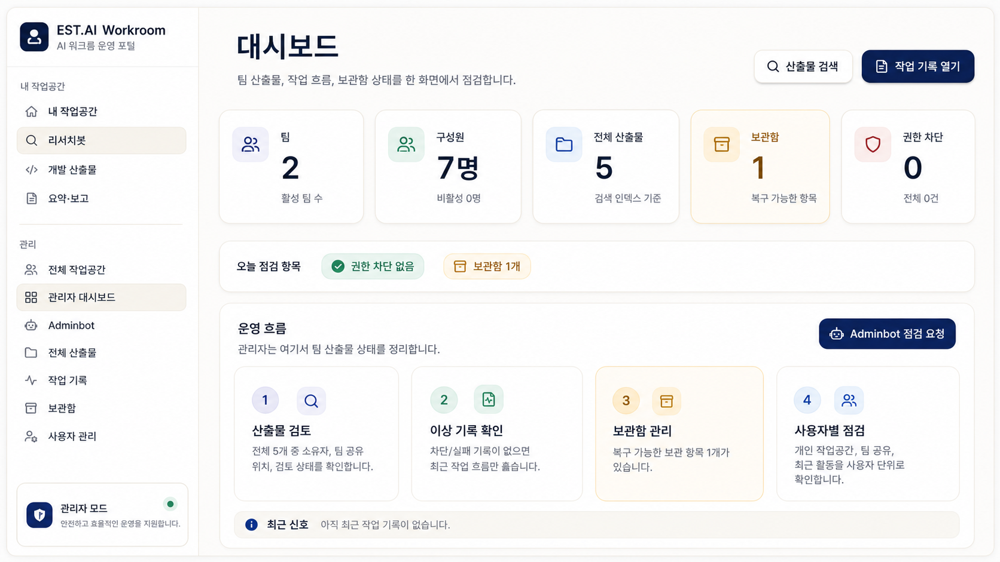

# Workroom Portal

팀이 **함께 쓰는 AI 에이전트 워크룸**. 리서치·개발·요약 역할별 봇에
요청하면 내용에 맞는 스킬이 자동으로 붙고, 결과물은 개인 작업공간에
쌓였다가 팀 공유로 넘어가고 관리자가 전체를 점검합니다.

<p align="center">
  
</p>

> 사내 운영본에서 조직·구성원 정보를 제거한 **공개판**입니다. 계정·팀·경로는
> 모두 예시 값(`team-alpha` / `사용자1` 등)으로 치환돼 있습니다.

## 왜 만들었나

AI에게 일을 시키는 건 개인이 하는데, 그 결과물은 팀이 씁니다. 그런데 보통
대화는 각자 창 안에 갇혀 있어서 **누가 무엇을 물어봤고 뭘 얻었는지가 팀에
안 남습니다.** 이 포털은 요청을 팀의 자산으로 만듭니다.

- 대화는 **역할별 봇**에게 — 리서치·개발·요약 각자 다른 지시와 출력 형식
- 답은 **파일로 저장** — 짧은 질문은 대화로, 조사 요청은 결론·비교표·출처·
  다음 액션이 담긴 문서로
- 문서는 **개인 → 팀 공유 → 관리자**로 흐름 — 누가 어디까지 보는지가 고정

## 에이전트 3종

| 역할 | 하는 일 | 출력 |
|---|---|---|
| **리서치** | 자료 조사, 비교, 출처 정리, 기술 검토 | 핵심 결론 · 비교표 · 출처 · 다음 액션 |
| **개발** | 코드 수정, 실행, 테스트, 디버깅 | 변경 요약 · 실행 결과 · 남은 과제 |
| **요약·보고** | 회의록, 요구사항, 보고서, 액션아이템 | 결정 사항 · 담당 · 기한 |

각 역할은 기본 스킬을 갖고, **요청 문구에서 필요한 스킬을 자동으로 더합니다** —
"논문"이 보이면 arxiv 계열, "PDF·첨부"면 문서 처리, "트렌드"면 RSS 계열.
라우팅 규칙 17종, 연결 가능한 스킬 80여 종. 사용자는 스킬을 몰라도 됩니다.

요청은 **비동기 작업 큐**로 돌아갑니다 — 창을 닫아도 진행되고, 완료되면
결과 파일이 작업공간에 나타납니다. 파일 잠금(`fcntl`)으로 동시 요청이
서로를 덮지 않습니다.

## 권한 경계

산출물이 팀 자산이 되려면 경계가 흐트러지지 않아야 합니다. 스코프 판정을
`portal_core.py` 한 곳에 모아, 뷰마다 권한을 다시 해석하지 않습니다.

- **개인 작업공간** — 본인만
- **팀 공유** — 개인에서 공유로 옮긴 것만 팀원이
- **관리자** — 전체 열람 + 검색·보관함·사용자별 점검

이동은 되돌릴 수 있고(보관함), 권한 밖 접근은 차단 사유와 함께 기록됩니다.

## 구조

```text
portal_agent_jobs.py  에이전트 역할·스킬 라우팅·비동기 작업 큐 (607줄)
portal_core.py        작업공간 스코프 규칙 (개인/공유/관리자)
portal_api.py         JSON API (1,860줄)
portal_auth.py        세션·권한 판정
portal_file_*.py      탐색 · 상세 · 스트리밍 (대용량 분할 전송)
portal_preview.py     Markdown 렌더 · 코드 하이라이트 · 인라인 미리보기
portal_admin_*.py     전체 검색 · 보관함 · 공통
portal_selftest.py    자체 점검 스위트 (1,443줄)
frontend/             React + TypeScript + Vite (Playwright 스모크 포함)
```

백엔드는 **외부 웹 프레임워크 없이** 파이썬 표준 라이브러리로 작성했습니다 —
HTTP 처리, 라우팅, 세션, 템플릿을 직접 구현해 의존성과 배포 표면을 줄였습니다.
전체 11,500여 줄.

## 실행

```bash
python3 setup_workroom_portal.py   # 작업공간·계정 초기화 (예시 구성)
python3 portal_app.py              # 포털 기동 (기본 8787)
```

```bash
cd frontend && npm install && npm run dev
```

자체 점검:

```bash
python3 portal_selftest.py
```

## 설계에서 신경 쓴 것

- **사용자는 스킬을 몰라도 된다** — 요청 문구에서 필요한 도구를 시스템이 고릅니다
- **권한은 경로에서 나온다** — 스코프 판정을 한 곳에 모아 뷰마다 재해석하지 않습니다
- **삭제는 복구 가능해야 한다** — 보관함을 거치고 관리자가 되돌릴 수 있습니다
- **차단은 조용하지 않아야 한다** — 권한 밖 접근은 사유와 함께 기록됩니다
- **점검은 코드로** — 권한·경로·스트리밍 회귀를 자체 점검 스위트로 고정했습니다

## 라이선스

MIT — [`LICENSE`](LICENSE)
